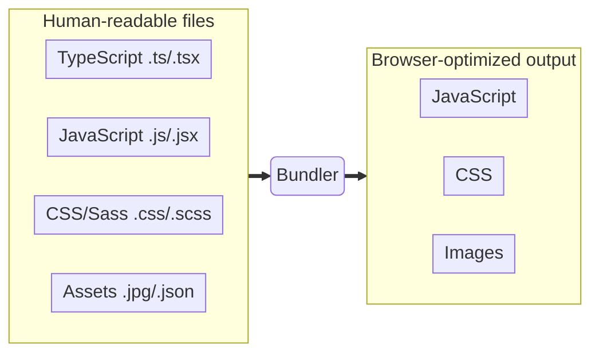

# Frontend web development frameworks

If you want to scale a feature-rich web application quickly along with a team, writing a scalable application requires structure, organization, and maintainability.

Fortunately, you don't need to decide on structure and tooling yourself.
[Frontend](https://en.wikipedia.org/wiki/Frontend_and_backend) frameworks make app development easier by providing more structure to the way we write applications.
They do come with a learning curve, but in return you get a more maintainable codebase, reusable components, nice conveniences, and helpful tooling. 
These benefits can really pay off as your project grows along with you and your team.

There are a lot of front-end frameworks to choose from. Some of the most popular are [React](https://react.dev/), [Vue](https://vuejs.org/), and [Angular](https://angular.dev/). 
There are some nuances, but generally, frontend frameworks encourage component-based/reusable code block architecture via a [top-down, one-way data flow](https://jurassix.gitbooks.io/dataflow-through-react/content/data-loading/top-down.html) which involves passing information from parent components to their children. 
In turn, frontend frameworks promote [declarative](https://en.wikipedia.org/wiki/Declarative_programming) code writing (e.g., more HTML and less JavaScript).

::: tip
Be sure to read up on [Node.js](https://developer.mozilla.org/en-US/docs/Glossary/Node.js), [npm](https://developer.mozilla.org/en-US/docs/Learn_web_development/Extensions/Client-side_tools/Package_management), [package.json](https://docs.npmjs.com/cli/v10/configuring-npm/package-json), [dependencies](https://docs.npmjs.com/cli/v10/configuring-npm/package-json#dependencies), [devDependencies](https://docs.npmjs.com/cli/v10/configuring-npm/package-json#devdependencies), and [semantic versioning](https://docs.npmjs.com/about-semantic-versioning) before you start working with frameworks, and you should also [download Node.js and npm](https://nodejs.org/en/download) on your machine before creating a framework-based application.
:::

### Component-based mapping libraries

There are a growing number of JavaScript mapping libraries as reusable React, Angular, web, or Vue components.
These component libraries are appealing because they allow developers to quickly integrate mapping functionalities as reusable code blocks into their applications without reinventing the wheel.
Some notable component libraries are:

- Open-source:
  - [Nivo React](https://github.com/plouc/nivo) (built on top of [D3](https://d3js.org/))
  - [Vue 3.x components for CesiumJS](https://github.com/zouyaoji/vue-cesium)
  - [React Leaflet](https://react-leaflet.js.org/)
  - [ngx-leaflet](https://www.npmjs.com/package/@asymmetrik/ngx-leaflet)
  - [ngx-maplibre-gl](https://github.com/maplibre/ngx-maplibre-gl)
  - [leaflet-map](https://github.com/leaflet-extras/leaflet-map)
  - [openlayers-elements](https://github.com/openlayers-elements/openlayers-elements)
- Commericial libraries:
  - [ArcGIS Maps SDK for JavaScript components](https://developers.arcgis.com/javascript/latest/components/)
  - [Google Maps JavaScript API Web Components](https://mapsplatform.google.com/resources/blog/build-maps-faster-web-components/#:~:text=Maps%20JavaScript%20API%20Web%20Components.%20Developers%20can%20access)

Although the main focus of this chapter is frontend frameworks, it's worth mentioning that some mapping libraries are framework-agnostic and provide [web components](https://developer.mozilla.org/en-US/docs/Web/API/Web_components) that can be used in any frontend framework or even plain JavaScript applications, meaning that you can use them regardless of your framework of choice.

The challenge with mapping libraries lacking framework-agnostic web components is that committing to one framework can make switching difficult, or the library might not even offer support for your desired framework. This scenario often requires you to build all the necessary UI components yourself.

::: info What are web components?

::: details

> [Web components](https://www.webcomponents.org/introduction) are a set of web platform APIs that allow you to create new custom, reusable, encapsulated HTML tags to use in web pages and web apps. Custom components built on Web Component standards will work across modern browsers, and can be used with any JavaScript library or framework that works with HTML.
> Web components are based on existing web standards, letting web developers easily extend HTML with new elements with encapsulated styling and custom behavior.

Interested in writing your own web components using a web mapping library? Check out these resources about the process:

- [omarkawach/foss-gis-web-components](https://github.com/omarkawach/foss-gis-web-components)
- [omarkawach/arcgis-web-components](https://github.com/omarkawach/arcgis-web-components)
- [Web Components Toolkit](https://wc-toolkit.com/)

:::

### Web components in plain JavaScript and React

Before the [ArcGIS Maps SDK for JavaScript introduced their new library of web components in version 4.28](https://www.esri.com/arcgis-blog/products/js-api-arcgis/developers/build-gis-web-apps-with-javascript-maps-sdk-components), widgets based on proprietary technology were the only means for adding UI to your web application. Implementing widgets in an app required a lot of boilerplate code and was [imperative](https://en.wikipedia.org/wiki/Imperative_programming) in nature.

The ArcGIS Maps SDK for JavaScript's switch from an imperative API for UI to a community standards-based component library makes it easier to use in plain JavaScript and frontend frameworks. 
Check out the code below accomplishing the same task using the SDK with imperative widgets versus declarative web components in plain JavaScript.

<BasicArcgisMap />

::: code-group

```html [Imperative widgets] ts:line-numbers {1}
<body>
  <div id="viewDiv"></div>
  <script>
    require([
      "esri/views/MapView",
      "esri/widgets/Legend",
      "esri/widgets/Search",
      "esri/WebMap",
    ], (MapView, Legend, Search, WebMap) => {
      const webmap = new WebMap({
        portalItem: {
          id: "11e173a4e2f040ae80d39e44ee29467a",
        },
      });
      const view = new MapView({
        container: "viewDiv",
        map: webmap,
      });
      const search = new Search({
        view,
      });
      const legend = new Legend({
        view,
      });
      view.ui.add(search, "top-right");
      view.ui.add(legend, "bottom-left");
    });
  </script>
</body>
```

```html [Declarative web components] ts:line-numbers {1}
<body>
  <arcgis-map item-id="11e173a4e2f040ae80d39e44ee29467a">
    <arcgis-search slot="top-right" />
    <arcgis-legend slot="bottom-left" />
  </arcgis-map>
</body>
```

:::

The neat part here is that the same web components can be easily used in React:

::: code-group

```jsx [React JSX with web components] ts:line-numbers {1}
import { StrictMode } from "react";
import { createRoot } from "react-dom/client";

// Individual imports for each component used
// Necessary in applications using bundlers like Vite or Webpack
import "@arcgis/map-components/components/arcgis-map";
import "@arcgis/map-components/components/arcgis-legend";
import "@arcgis/map-components/components/arcgis-search";

// A reusable React component wrapping ArcGIS web components
function App() {
  return (
    <arcgis-map item-id="02b37471d5d84cacbebcccd785460e94">
      <arcgis-search slot="top-right" />
      <arcgis-legend slot="bottom-left" />
    </arcgis-map>
  );
}

// Mount the App component to the DOM
const root = createRoot(document.getElementById("root"));
root.render(
  <StrictMode>
    <App />
  </StrictMode>,
);
```

:::

### Tooling

HTML/CSS/JavaScript are core features of modern web browsers. 
Frameworks like React or Vue extend these native web technologies.

[Bundlers](https://webreference.com/javascript/advanced/module-bundlers/) like [Vite](https://vite.dev/) optimize and prepare framework-based applications for browsers by reducing file sizes and splitting bundles.



Furthermore, adding [TypeScript](https://www.typescriptlang.org/) to frontend frameworks like React provides an improved developer experience. TypeScript's static typing adds a layer of safety to JavaScript development, reducing uncertainty and boosting confidence.

::: info Code sample
Check out [this code repository](https://github.com/omarkawach/maps-sdk-react-ts) combining the ArcGIS Maps SDK for JavaScript with React, Vite, and TypeScript.
:::

## Next steps

We've seen how frontend frameworks can help scale web mapping applications quickly and efficiently by promoting reusable components, maintainable codebases, and helpful tooling.

The natural next step is learning implications of where your data is hosted and application rendering strategies for robust real-world success.
Strategies to improve [search engine optimization](https://en.wikipedia.org/wiki/Search_engine_optimization), performance, and additional scalability will be covered in the next chapter.
